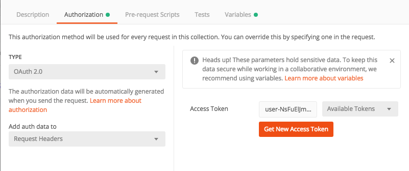
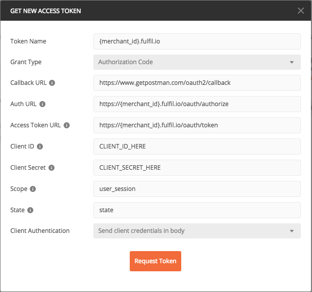

Oauth
=====

Your app cannot read Fulfil.IO data without authenticating first. It
must get permission from a user before gaining access to any of the
resources in the REST API. This guide will walk you through the
authorization process (described in greater detail by the  `OAuth 2.0
specification`_).

.. contents:: In this guide
   :local:
   :depth: 1

Terminology
--------------

Before getting into the nitty-gritty of the authorization process, let’s
go over some of the terms that we’ll be using for the rest of the guide.

**Client**

   Any application that would like access to a Fulfil account's data. A
   user (usually the customer's administration users) must grant
   permission before the client can access any data.

**API**

   Fulfil's REST API. This is the place where the client can view and
   modify data.

**User**

   A Fulfil account holder, usually an administrator of a Fulfil
   customer. This is the person giving permission to a client to access
   their data through the REST API.


Step 1: Get the client's credentials
------------------------------------

You will need to retrieve an API Key and Secret Key as the client uses
them to identify itself during the authorization process.

To retrieve the credentials:

#. Open the **Apps** section of Fulfil `authentication dashboard <https://auth.fulfil.io/user/clients>`_.
#. Click the name of the app to view its details.
#. Click \ **Get API Credentials** and scroll down to \ **App
   Credentials**. The Client ID is displayed for you, and you can
   click \ **Show** next to \ **Client Secret Key** to view the Secret
   key.


Step 2: Ask for permission
------------------------------------

The first step of process is to get authorization from the user. This is
done by displaying a prompt provided by Fulfil:

|image0|

To show the prompt, redirect the user to this URL:

::

   https://{subdomain}.fulfil.io/oauth/authorize?response_type=code&client_id={client_id}&redirect_uri={redirect_uri}&state={nonce}

With these substitutions made:

-  ``{subdomain}`` - substitute this with the subdomain of the
   customer's fulfil instance.
-  ``{client_id}`` - substitute this with the app’s Client ID obtained
   in step 1.
-  ``{scopes}`` - substitute this with a comma-separated list of scopes.
-  ``{redirect_uri}`` - **(Required)** substitute this with the URL
   where you want to redirect the users after they authorize the client.
   The complete URL specified here \ **must** be identical to one of
   the \ *Application Redirect URLs*.
-  ``{nonce}`` - a randomly selected value provided by your application,
   which is unique for each authorization request. During the OAuth
   callback phase, your application must check that this value matches
   the one you provided during authorization. This mechanism is
   important for \ `the security of your application`_.


Step 3: Confirm installation
------------------------------------

When the user clicks the  *Install* button in the prompt, they will be
redirected to the client server as specified above. One of the
parameters passed in the confirmation redirect is the \ *Authorization
Code* (the other parameters will be covered later in the guide).

::

   https://example.com/authorized?state=state&code=authorization_code

Before you proceed, make sure your application checks that the provided 
*nonce* is the same one that your application provided to Fulfil during
the \ *Step 2: Asking for permission*. If the states don't match, the
request may have been created by a third party and you should abort the
process.

**Exchange the authorization code for an access token**

.. code-block:: HTTP

   POST https://{subdomain}.fulfil.io/oauth/token

With  ``{subdomain}`` substituted for the name of the customer's fulfil
account and with the following parameters provided in the body of the
request:

-  ``client_id``
   The  *Client ID* for the app (see the credentials section of this
   guide).
-  ``client_secret``
   The  *Secret Key* for the app (see the credentials section of this
   guide).
-  ``code``
   The authorization code provided in the redirect described above.

You'll receive a JSON response containing an access_token (among other
details):

.. code-block:: json

   {
     "access_token": "user-xxxxx-xxxxxxx", 
     "associated_user": {
       "email": "first.last@example.com", 
       "id": 1, 
       "name": "First Last"
     }, 
     "expires_at": 1495030543.313099, 
     "expires_in": 3600, 
     "refresh_token": "refr-xxxxx-xxxxxxx", 
     "scope": [
       "user_session"
     ], 
     "token_type": "Bearer",
     "offline_access": {
       "offline_user_id": 12,
       "offline_access_token": "bot-xxxxx-xxxxxxx"
     }
   }

-  ``offline_access_token`` is an API access token that can be used to
   access the data as long as the client is installed. Clients should
   store the token somewhere (like a database) to make authenticated
   requests for a shop’s data.


Headless applications
------------------------------------

Headless applications that need an offline token should get one with
an offline generation script and then use the exchanged token.

Example using python

.. code-block:: python

    import webbrowser
    from fulfil_client.oauth import Session
    import os

    def get_token():
        Session.setup(
            os.environ['FULFIL_APP_ID'], os.environ['FULFIL_APP_SECRET']
        )
        session = Session(os.environ['FULFIL_SUBDOMAIN'])
        oauth_session = session
        authorization_url, state = oauth_session.create_authorization_url(
            redirect_uri='urn:ietf:wg:oauth:2.0:oob',
            scope=['sale.channel:read'],
            access_type='offline_access'
        )
        webbrowser.open(authorization_url)
        # paste code here
        code=raw_input('paste authorization code here\n')
        token = oauth_session.get_token(code=code)
        return token


    if __name__ == '__main__':
        token = get_token()
        print token['offline_access_token']


Using Postman
-------------

`Postman <https://www.getpostman.com/>`_ is an OSX application that
lets you send HTTP requests to Fulfil API endpoints. It can be a
useful tool for getting started with the Fulfil API or for debugging
your apps.


Using Oauth 2.0 with Postman
````````````````````````````

Step 1: Select Oauth 2.0 as the authorization
'''''''''''''''''''''''''''''''''''''''''''''



Step 2: Get an access token
'''''''''''''''''''''''''''''''''''''

* Grant Type as `Authorization code`
* Callback URL: `https://www.getpostman.com/oauth2/callback`
* Auth URL: `https://{merchant_id}.fulfil.io/oauth/authorize`
* Access Token URL: `https://{merchant_id}.fulfil.io/oauth/token`
* Client ID: Client ID obtained in steps above
* Client Secret: Client Secret obtained in steps above
* Scopes: Enter the scopes needed
* State: Enter a random string that should be used as state
* Client Authentication: `Send client credentials in body`




.. _OAuth 2.0 specification: https://tools.ietf.org/html/rfc6749
.. _Terminology: #terminology
.. _`Step 1: Get the client's credentials`: #get-credentials
.. _`Step 2: Ask for permission`: #ask-permission
.. _`Step 3: Confirm installation`: #confirm-installation
.. _`Step 4: Making authenticated requests`: #making-authentication-requests
.. _API Access modes: #api-access-modes
.. _authentication dashboard: https://auth.fulfil.io/user/clients
.. _the security of your application: https://tools.ietf.org/html/rfc6819#section-3.6

.. |image0| image:: https://s3.amazonaws.com/helpscout.net/docs/assets/58f9edc82c7d3a057f88701a/images/591eecb50428634b4a334770/file-4UYFKxikUd.png
