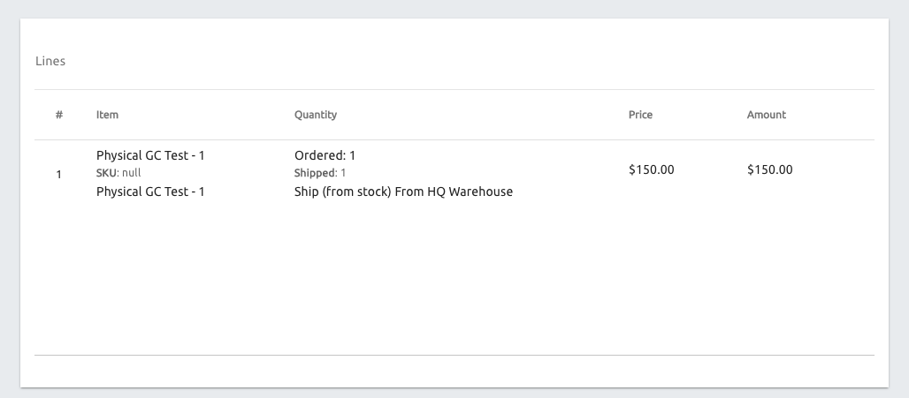
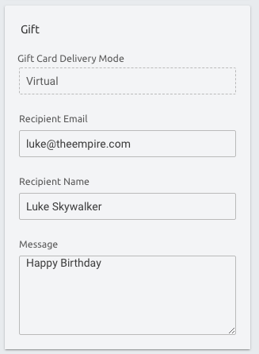
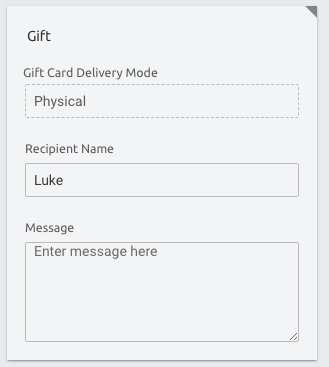
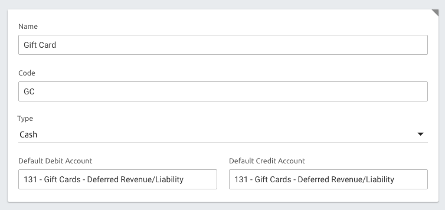
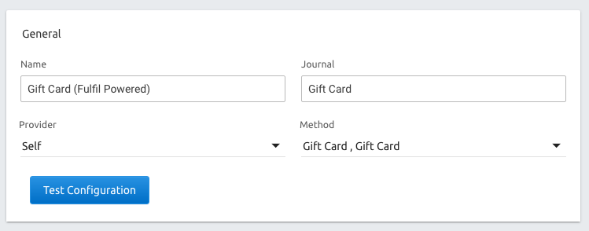
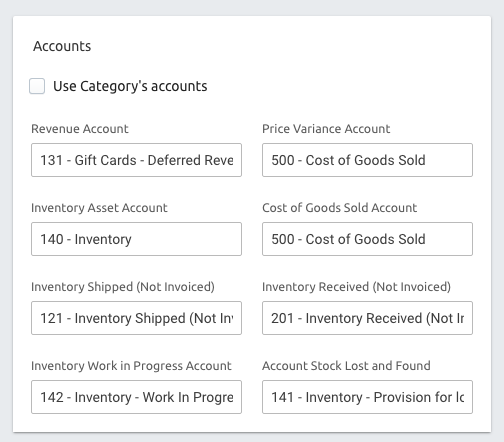

Gift Cards
==========

This document outlines how the Fulfil gift card work-flow functions. You will
need this only if you want to use Fulfil as your gift card registry. You will
not need this if you're using an e-commerce platform like Shopify that already
implements Gift Cards natively.

.. contents:: In this guide
   :local:
   :depth: 1

How it works
------------

When an order with a gift card is processed, Fulfil looks for line items of type
`gift card` and creates gift cards for those items.

In the below example, the order has two line items. A ring and a gift card. Since
the gift card is a physical gift card, the item also appears on a shipment.


On the other hand if the gift card was a virtual gift card, the card would be
emailed to the recipient (not the customer).


Setting up Gift Cards
---------------------

Gift cards are products too in Fulfil. So to create a gift card type product, 
go to products and create a new product. On the bottom right you will find a 
block where you can check the box for `Is Gift Card` and change settings specific 
to gift cards.

There are two types of gift cards - physical (shipped to the customer) and 
virtual gift cards (emailed to the customer).

Physical Gift Cards
````````````````````

Physical gift cards are paper based or card based items. As far as fulfil goes,
these gift cards are shipped and will appear on the picking/packing list on 
shipments (while virtual cards are digitally delivered).

Virtual Gift Cards
``````````````````

As described by the name, these are not physical gift cards and they won’t appear
on shipments. Fulfil will directly send these gift cards by email to the customer.

For virtual gift cards, remember to change the Product Type to a service from 
Goods. If not you will receive an error.

Selling Gift Cards
------------------

To sell a gift card, just add the item to an order like any other line item. 



In the detailed view of the order line, you will be able to set gift card specific 
preferences.

**Example 1: Virtual Gift Card Order**

In this example, a virtual gift card is being sent to Luke.
The Recipient email is where the gift card will be sent to.



**Example 2: Physical Gift Card Order**

In this example, a physical gift card is being sent to Luke.



Using gift cards for order payment
----------------------------------

When a customer wants to use a gift card for payment, this can be done by using the 
Gift Card Gateway of Fulfil.

Setup Gift Card Journal
````````````````````````

This journal is required to setup a payment gateway in the next step
From Settings > Journal, create a new Journal.



The journal ensures that the GL - 131 in this case is debited when a payment is 
made using a gift card. Read more about this in the accounting section below.

Gift Card Gateway
``````````````````

From settings > Payment Gateways setup a new gateway. Gateways allow using
gift cards as payment methods in orders.



You can now use this in the payments of a gift card.

Integration Guidelines
----------------------

1. We recommend creating a single gift card product template and then setting 
   up a variant each for the physical gift card and virtual gift card.
2. For both, setup allow open amounts. With this setting you can define the
   amount of the gift card as the order line `unit_price`. If this is not 
   selected, then the amount will be restricted to one of the amounts you add 
   and you will have to update both your e-commerce system and Fulfil when 
   you want to allow a custom amount.

Sale of gift cards
``````````````````

We recommend creating orders with the `channel.create_order` api.

In the api, in the order lines, add additional attributes required for gift
cards to be handled:

.. code-block: javascript

    {
        ...
        "sale_lines": [
            {
            "sku": "gift-card-sku",
            "unit_price": "100.00",
            "quantity": 1,
            "recipient_email": "email@something.com",
            "recipient_name": "Full Name of the recipient",
            "gift_message": "Message to print on gift card",
            }
        ]
        ...
    }


Gift card as a payment method
``````````````````````````````

When a gift card is used in an order, send that detail also on the payment.

The below example, shows a partial payment with gift card and a credit card.

.. code-block: javascript

    {
        ...
        "payments": [{
            "amount": "50.00",
            "method": "gift_card",
            "state": "success",
            "provider_reference": "gift_card_number",
        }, {
            "amount": "50.00",
            "method": "stripe",
            "state": "success",
            "provider_reference": "stripe_txn_id",
        }]
        ...
    }


Querying status of Gift Card
``````````````````````````````

To query the current status of a gift card, you can use the gift card api.

.. code-block:: python

    GiftCard = fuflil.model('gift_card.gift_card')
    GiftCard.search_read(
        [
          ('number', '=', '1001001001'),
          ('state', '=', 'active'),   # Limit to active to ensure canceled GCs are not used
        ],
        None,
        [
            'amount',  # The amount of the gift card
            'amount_available',  # the amount still remaining on gift card
        ]
    )

Updating the gift card
``````````````````````````````

In this example, we are updating the number of the gift card. This is used for 
example if automatically issued card numbers have to be overwritten with a 
card number on a physical card.

.. code-block:: python

    GiftCard.write([123], {'number': '1011-010020-1020202'})

Accounting/Financials
---------------------

Revenue Recognition
````````````````````

Sale of a gift card is not direct revenue, but deferred revenue. To ensure this, you 
must setup the product template with the right accounting to recognize deferred 
revenue instead of standard revenue/sales accounts.

- **Revenue Account**: Deferred Revenue GL
- **Price Variance/COGS**: Setup as COGS account. This is used when physical gift 
  cards are purchased and shipped. The COGS would be the cost of the physical card.
- **Inventory**: Used only when the physical gift card has inventory.



**Journal Entries**


|    | Account             | Debit   | Credit  |
| -- | ------------------- | ------- | ------- |
| CR | Deferred Revenue    |         | $100.00 |
| DR | Accounts Receivable | $100.00 |         |


Gift Card Consumption
``````````````````````

When the gift card is sold and the payment appears on the sale payments fulfil 
will automatically debit the Deferred Revenue account.

**Journal Entries**

|    | Account             | Debit   | Credit  |
| -- | ------------------- | ------- | ------- |
| DR | Deferred Revenue    | $100.00 |         |
| CR | Accounts Receivable |         | $100.00 |


Using Pre-printed Physical Cards
--------------------------------

If your store has pre-printed physical gift cards, we recommend the following workflow:


1. On processing order, Fulfil creates a gift card.
2. The shipper sees the physical gift card in the picking list and adds 
   an empty gift card to the picked item.
3. The packer then uses a custom interface to map the gift card with the 
   physical gift card. This process just overwrites the gift card `number` on 
   Fulfil with the number on the physical gift card.

Migrating existing gift cards
-----------------------------

If you have existing gift cards that were issued from a legacy system
and needs to be migrated to Fulfil, you can do that by creating gift
cards directly over the API (without creating orders).

A few things to note:

1. Always create the gift card with the balance on card (not the 
   original amount)
2. Fulfil will not create journal entries for deferred revenue. Accounting
   for gift cards is only done when the orders create gift cards. Any existing
   gift card deferred revenue should be brought in as the opening balance of
   the deferred revenue GL.

.. code-block:: python

    #!/usr/bin/env python
    # -*- coding: utf-8 -*-
    """
    Script to migrate existing gift cards
    """
    from decimal import Decimal

    from fulfil_client import Client


    fulfil = Client('{merchant}', '{apikey}')

    GiftCard = fulfil.model('gift_card.gift_card')


    gcs = [
        {
            # The number of the gift card
            'number': 'OLD-12346',

            # This is the remaining amount 
            # (not the original GC amount).
            'amount': Decimal('100'),

            # Set the currency of the GC
            'currency': 172,

            # Any additional information can be set
            # on the comment field for internal refernce
            'comment': 'This is a comment',

            # State can be 'draft' or 'active'
            'state': 'active',
        }
    ]

    if __name__ == '__main__':
        print GiftCard.create(gcs)


FAQ
---

How do we create gift cards in advance for physical gift cards?
```````````````````````````````````````````````````````````````

Nope you don’t. You can generate random numbers yourself and send 
it to the printer. We recommend mapping those numbers when it 
has to be shipped to a customer with a Fulfil generated gift card.
Why? Because pre-printed active gift cards are a security nightmare. 
Someone displaces a pack and you now have lost money 😄 💸 

How is the gift card number in Fulfil generated?
````````````````````````````````````````````````

Like with all numbers in Fulfil, this unique number is also
generated using sequences. You can change this by going to 
Settings > Gift Card Settings and then editing the sequence. 

Our recommendations are to use:

- Type: Hexadecimal Timestamp
- Prefix: Use Brand Year month - M${year}${month}-
- Suffix: Use ${day}

This generates a hexadecimal code with the year, month and date 
interlaced with the data.


Why is there a `gc_price` on Sale order line?
`````````````````````````````````````````````

The gc_price on the sale order line allows picking an amount from 
existing amounts. This is not recommended for API integrations. You will be 
forced to pick an existing amount id (not the amount itself). We recommend 
allowing open amounts and using the unit_price as the amount.
