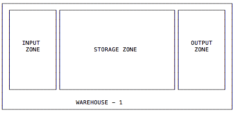

Inventory Management
====================

This guide explains how to retrieve and update product inventory. Fulfil
is a multi-location, multi-warehouse system. This guide also explains how
to handle inventory by locations.


.. contents:: In this guide
   :local:
   :depth: 1

Inventory Resources
-------------------

It's helpful to understand the different objects and their relationships before
building applications that read or update inventory.

Variant
```````

Each color and size combination of a product is called a **product (variant)**. 
Each variation is an item the customer can buy, while the template itself is a way to 
organize them under one common set of attributes.

:doc:`Learn More </guides/product-management>`


Location
````````

Represents a geographic location (like a warehouse) or a sub location (like a bin) 
within a geographic location. 

Locations can have many levels depending on the customer implementation

Locations
---------

Locations in fulfil serve multiple purposes. They could be geographic locations
like a warehouse, a virtual location to move inventory in and out of like a
`lost and found` location or a sublocation of a warehouse like a bin.

Default Implementation
````````````````````````

The default implementation usually includes the following strucutre for warehouses.



In addition to this setup for each warehouse of the company, Fulfil also creates some
virtual locations by default.

Customer 
    Virtual location to track inventory shipped to customers.

Suppliers
    Virtual location to track inbound inventory from suppliers.

Lost and Found
    Virtual location to which inventory is moved when lost or received from when
    inventory is found.

Initial Inventory
    This location is used when initial inventory is imported into Fulfil when a customer
    migrates into Fulfil.

Transit
    The transit location is a storage zone that houses inventory in transit between 
    warehouses.

Drop
    Similar to the transit location, but used as the interim location for drop shipments. 
    Inventory resides in the location after the supplier has shipped, but before the inventory
    has been received by the customer.

How locations work
```````````````````

All stock movements happen between two locations, very much like a double entry accounting
principle but as a single entry. So for example

Supplier Inbound Shipment
    Inventory moves from `supplier` virtual location to `input zone` of warehouse

Customer Shipment
    Inventory moves from `output` zone of the warehouse to `customer` 

Customer return shipment
    Inventory moves from `customer` virtual location to `input zone` of warehouse

Drop Shipment  
    Inventory moves from `supplier` location to `drop` once the supplier ships and then
    from `drop` to the `customer` location when the customer receives it.

Inventory is lost 
    Inventory moves from the storage location to `lost and found`.

Inventory is found
    Inventory moves from `lost and found` to the storage zone.

Quantity Concepts
------------------

Fulfil exposes different insights about inventory levels through quantity
fields on the product. This article attempts to explain what the fields
mean.

Quantity On Hand (QOH)
   The quantity that should currently be on the shelves in a warehouse.
   If you're building an app that counts inventory in the warehouse, this
   would be the number you're looking for.

Quantity Available
   The quantity of product available to promise to a sales order or an
   internal shipment or production order. This is usually the number that
   would be exported to order channels like Shopify or Amazon.

Quantity Buildable
   This is only available for products that have a Bill-of-materials (BOM)
   associated with it. Those are usually produced (manufactured) products
   or bundled.

Common API Use Cases
--------------------

The section below is a guide on the most common use cases of the inventory
APIs of Fulfil.

Fetch inventory of products
````````````````````````````

.. code-block:: shell

   curl 'https://{merchant}.fulfil.io/api/{version}/model/product.product/read'
      -X PUT
      -H 'X-API-KEY: {YOUR_API_KEY}' \
      -H 'Content-Type: application/json' \
      -d '[[PRODUCT_ID1, PRODUCT_ID2], ["quantity_on_hand", "quantity_available"]]'

.. code-block:: python

   Product = fulfil.model('product.product')
   Product.read([PRODUCT_ID1, PRODUCT_ID2], ['quantity_on_hand', 'quantity_available'])

The response is a list of objects for each product

.. code-block:: javascript

   [{"quantity_on_hand": 30.0, "id": 157, "quantity_available": 40.0}]


Fetch inventory of products (in a specific location)
````````````````````````````````````````````````````

The above example returns inventory and if you have only 1 warehouse the
quantity numbers make sense. However, you often need to know what the inventory
is, in each location.

If you have the location id, you can specify that as additional context
for the above request to retreive inventory of the product for those locations.

.. code-block:: shell

   curl 'https://{merchant}.fulfil.io/api/{version}/model/product.product/read?context={"locations": [LOC_ID]}'
      -X PUT
      -H 'X-API-KEY: {YOUR_API_KEY}' \
      -H 'Content-Type: application/json' \
      -d '[[PRODUCT_ID1, PRODUCT_ID2], ["quantity_on_hand", "quantity_available"]]'

.. code-block:: python

   Product = fulfil.model('product.product')
   Product.read(
      [PRODUCT_ID1, PRODUCT_ID2],
      ['quantity_on_hand', 'quantity_available'],
      context={'locations': [LOC_ID]}
   )


By providing one or more location IDs in context, you can retreive the
quantity numbers for the product for the location(s).

If more than 1 location is specified, the quantites in those locations are added.

Locations could be warehouse IDs or storage zone IDs.

Full Counts/Cycle Counts
-------------------------

Full and Cycle counts are a standard feature of Fulfil and these APIs
can help you build tools around the process.

Starting a new count
````````````````````

To start a new cycle count, create a new record on `stock.inventory`. This
will appear as an inventory adjustment under Inventory & Stock.

To start a count, you will need two pieces of information:

1. The ID of storage zone where the count is being done. This cannot be the
   ID of a warehouse. If you are counting an entire warehouse, then the
   location should be the ID of the storage area of the warehouse - which
   excludes inventory in the outbound zone and input zone that is not on
   shelf.
2. The ID of the lost and found location where the inventory will be written
   off to.


.. code-block:: python

    IS = fulfil.model('stock.inventory')
    IA.create([
        {
            'location': 70,
            'lost_found': 7,
            'type': 'cycle',
        }
    ])

.. code-block:: shell

    curl 'https://{merchant}.fulfil.io/api/{version}/model/stock.inventory/create' \
        -X 'PUT' 
        -H 'X-API-KEY: {YOUR_API_KEY}' \
        -H 'Content-Type: application/json' \
        -d '[[{"type": "cycle", "location": 70, "lost_found": 7}]]'

The above calls return the ID of the cycle count that has been created. You can now
add items to count to the cycle count.

.. code-block:: javascript

    [344]


Adding counts of items
```````````````````````

You could be using a CSV generating barcode scanner, a handheld device or some other way
to identify the products being counted. Irrespective of the method being used, you can
add lines (1 per product) to the count.

.. code-block:: python

    IAL = fulfil.model('stock.inventory.line')
    IAL.create([
        {
            'product': 157,         # ID of the product
            'quantity': 11,         # Quantity found
            'inventory': 346,       # ID of the count (from previous step)
        }, {
            'product': 158,
            'quantity': 190,
            'inventory': 346,
        }, 
    ])

.. code-block:: shell

    curl 'https://{merchant_id}.fulfil.io/api/{version}/model/stock.inventory.line/create' \
    -X 'PUT' \
    -H 'X-API-KEY: {YOUR_API_KEY}' \
    -H 'Content-Type: application/json' \
    -d '[[{"product": 157, "inventory": 346, "quantity": 11}, {"product": 158, "inventory": 346, "quantity": 190}]]'

You can (and should) create multiple lines at once for performance.


Completing counts
``````````````````

The counts can be complete by calling the `complete` method on an inventory count.

Calling complete indicates that the count is complete (but not confirmed). When marked
as complete, fuflil automatically updates the expected quantity on the line items based
on the date of the cycle count.

There are several reasons why the completed step exists before the counts are confirmed:

1. The merchant workflow might include a manager confirming the counts (and the differences
   in counts). In this case, the picker (or store person) completes the count and then the
   manager confirms (and finalizes) the count.
2. Delayed counts: Sometimes counts are performed on weekends or during night shifts and
   the counts are reviewed by someone else on a different shift. Having completed counts
   works like an inbox for the purpose.

To trigger completion over the API:

.. code-block:: python

    IA = fulfil.model('stock.inventory')
    IA.complete([346])

.. code-block:: shell

    curl 'https://{merchant_id}.fulfil.io/api/{version}/model/stock.inventory/complete' \
    -X 'PUT' \
    -H 'X-API-KEY: {YOUR_API_KEY}' \
    -H 'Content-Type: application/json' \
    -d '[[346]]'


Confirming counts
``````````````````

While it is possible to confirm counts on the API, most implementations we have seen 
performs this function from the Fuflil UX. However, should you decide to implement the
functionality, you can confirm a count by calling the confirm endpoint of a
stock inventory adjustment record.

.. code-block:: python

    IA = fulfil.model('stock.inventory')
    IA.confirm([346])

.. code-block:: shell

    curl 'https://{merchant_id}.fulfil.io/api/{version}/model/stock.inventory/confirm' \
    -X 'PUT' \
    -H 'X-API-KEY: {YOUR_API_KEY}' \
    -H 'Content-Type: application/json' \
    -d '[[346]]'


Gotchas
```````

Adding same product multiple times to a count.
~~~~~~~~~~~~~~~~~~~~~~~~~~~~~~~~~~~~~~~~~~~~~~~

Fulfil allows the same product to be added multiple times to the same counts. While this
is mostly used as a way to count the same product across multiple lot/serial/batches, it
is a common source of confusion.

To prevent accidental errors, Fulfil will prevent the count from being confirmed if the
same product exists multiple time (without different lot numbers).