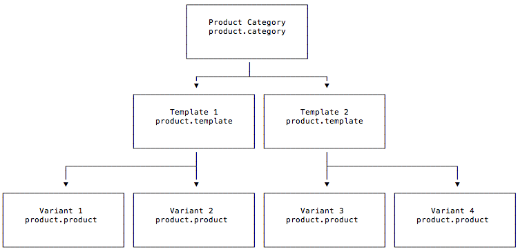
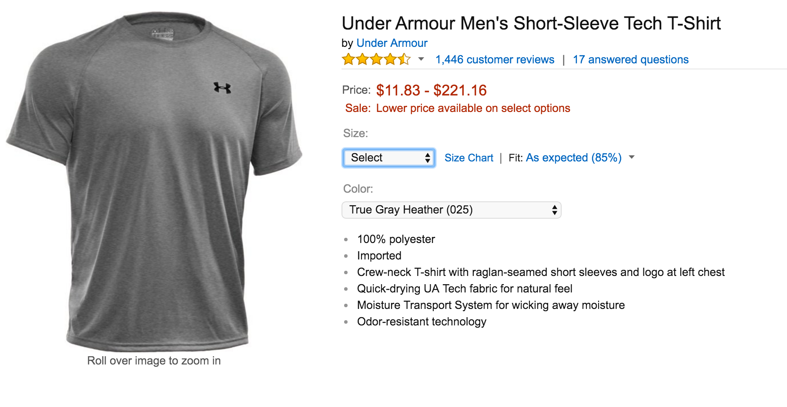
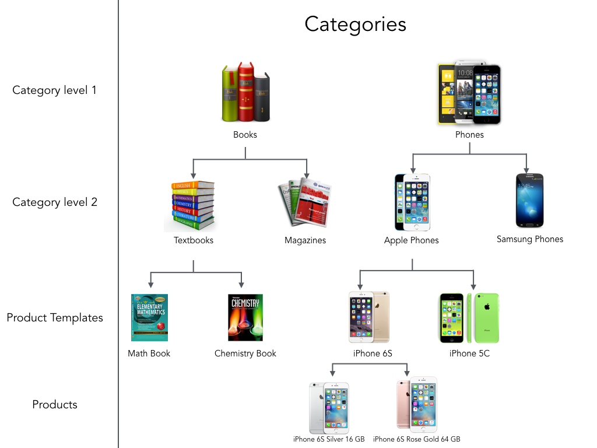

Product Management
==================

This guide explains how to create, retreive and update product information.
Because product information is also organized around multiple models, this 
guide explains the organization or product data.

.. contents:: In this guide

Product information resources
-----------------------------

Before you begin working with products, it's helpful to understand the relationships
between the product resources:



Often, an item comes in a variety of sizes and colors. A shirt, for example, might 
come in four different sizes and five different colors.



**Product Template**: In the example above, "Under Armour Men's Short-Sleeve Tech T-Shirt"
is the template. This is how a customer would look for a product.

**Product Variant**: Each color and size combination is called a **product (variant)**. 
Each variation is an item the customer can buy, while the template itself is a way to 
organize them under one common set of attributes.

If a shirt came in four sizes and five colors, there would be twenty variations, each with
a unique SKU.

**Product Category**: Categories offer a way to organize the items in Fulfil into groups.
Categories are primarily designed for use with financials and not for marketing.



Retreive Products
------------------

The following steps explain how to use the product resources.

Fetching a specific product
```````````````````````````

You can fetch a specific product with the unique ID of the product.

**Curl**

.. code-block:: shell
    
    curl -X GET \
        https://{merchant}.fulfil.io/api/v1/model/product.product/{product_id} \
        -H 'x-api-key: {your-api-key}'

**Python**

.. code-block:: python

    Product = fulfil.model('product.product')
    product = Product.read([product_id])

**Response**

.. code-block:: js

    {
        "id": 12195009364024,
        "code": "SKU-OF-PRODUCT",
        "variant_name": "Name of the variation",
        "type": "goods",
        "template": 12323443567,
        ...
    }

Searching for products
``````````````````````

You can search for products with filters.

In the first example, we are searching for products without any filters.

**Curl**

.. code-block:: shell

    curl -X PUT \
        https://{merchant}.fulfil.io/api/v1/model/product.product/search \
        -H 'x-api-key: {your-api-key}' \
        -d '[[]]'

**Python**

.. code-block:: python

    search_filter  = []     # no filter, get all
    Product = fulfil.model('product.product')
    product = Product.search(search_filter)


**Response**

The response is a list of ids of products.

.. code-block:: javascript

    [
        12195009364024,
        12195009364025,
        12195009364026,
        12195009364027,
        ...
    ]

**Next steps**

The :doc:`search api<../getting-started/searching-filtering>` provides more options
to paginate and order the results like you could with a `SELECT` sql query.

Search and Read at once
````````````````````````

To reduce API calls and stay within rate-limits, Fulfil offers a faster
way to search and read records in one API call. However, this requires
you to know the fields that you need returned.

The API call requires:

`filter, offset, limit, order, field names`

Example:

**Curl**

.. code-block:: shell

    curl -X PUT \
    https://{merchant}.fulfil.io/api/v1/model/product.product/search_read \
    -H 'Content-Type: application/json' \
    -H 'x-api-key: YOUR_API_KEY' \
    -d '[[], null, null, [["code", "ASC"]], ["variant_name", "code"]]'

**Python**

.. code-block:: python

    products = Product.search_read(
        [],
        None,
        None,
        [('code', 'ASC')],
        ['variant_name', 'code']
    )

**Response**

.. code-block:: javascript

    [
        {
            "code": "ABC-1",
            "id": 12195009364024,
            "variant_name": "Apple iPhone X - 64GB - White"
        },
        {
            "code": "ABC-2",
            "id": 12195009364025,
            "variant_name": "Apple iPhone X - 64GB - Black"
        },
        ...
    ]

:doc:`Learn more<../getting-started/searching-filtering>` about searching 
and filtering.